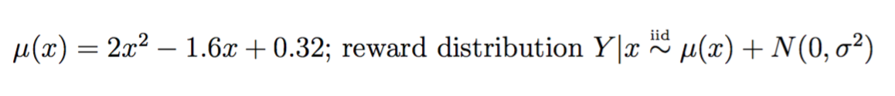

# Stochastic Golden Search
## Background
The Stochastic Golden Search [1] is a hueristic search algorithm to locate the minima (or maxima) in a unidimensional space with stochastic reward. It is based on the Golden Section Search [2] algorithm used for determinist setting. Suppose we want to locate the minima of a loss function μ(x):[0,1] -> [0,1] by repeatedly sample x and observe a stochastic reward Y, where E(Y|x) = μ(x). Assume μ satisfys the following assumptions:
<p align="left">
  
</p>

The Stochastic Golden Search shrinks the search interval by a fixed factor 1/φ = 0.618...over each search stage, where φ is the Golden Ratio. 
<p align="left">
  
</p>


## Simulation with Shiny App 
The shiny app simulate the search for the following example.
<p align="left">
  
</p>
You will need RStudio and internet connection to run the app. Click [here](https://www.rstudio.com/home/) to install RStudio.

To launch the shiny app, open RStudio and run the following code. 

```R
# install shiny package if not found
if(!"shiny" %in% installed.packages()){install.packages("shiny")}

library(shiny)
runGitHub("shiny-SGS","alisonswu")
```

## Bibliography
[1]Kiefer, J. (1953). Sequential minimax search for a maximum. Proceedings of the American mathematical society 4 (3), 502-506.

[2]Jia, Y. Y. and S. Mannor (2011). Unimodal bandits. In Proceedings of the 28th International Conference on Machine Learning (ICML-11), pp. 41-48.

